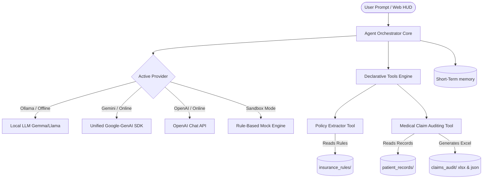

# 🏥 Mediclaim AI Agent

<p align="center">
  <a href="https://github.com/rajeshc-git/mediclaim-ai-agent/graphs/contributors">
    
  </a>
  <a href="https://github.com/rajeshc-git/mediclaim-ai-agent/network/members">
    
  </a>
  <a href="https://github.com/rajeshc-git/mediclaim-ai-agent/stargazers">
    
  </a>
  <a href="https://github.com/rajeshc-git/mediclaim-ai-agent/issues">
    
  </a>
  <a href="https://github.com/rajeshc-git/mediclaim-ai-agent/pulls">
    
  </a>
</p>

Mediclaim AI is a production-grade, offline-first health insurance claim auditing and compliance system. Built on a modular **ReAct (Reason + Act)** orchestration loop, the agent dynamically reconciles medical bills, evaluates patient records against complex policy guidelines, and generates boardroom-ready Excel audit sheets.

The system is designed for high security and **100% offline local execution** via local LLM engines (like **Ollama**), with intelligent fallback to connected APIs (**Google Gemini** & **OpenAI**) or a robust **Mock Sandbox** mode when offline.

---

## 🌟 Key Features

* **Offline-First Brain (Ollama & Mock Sandbox)**: Run fully offline using local models (e.g., `gemma4:latest`, `llama3`). If no API keys or local services are available, a robust mock engine simulates ReAct reasoning steps for sandbox testing.
* **Automated Policy Profile Extraction (`policy_extractor.py`)**: Dynamically parses massive insurance policy PDFs (`pypdf`) and master Excel files (`openpyxl`). It utilizes the LLM to extract key parameters (deductibles, room caps, waiting periods, specialty coverage) and caches them locally as structured JSON profiles under `insurance_rules/`.
* **Clinical Registry Verification (`medical.py`)**: Automatically maps ICD-10 diagnostic codes to CPT procedural treatment codes. Features a curated offline Clinical Code Registry to check for coding mismatches, pre-existing conditions, and room rent cap violations.
* **Boardroom-Ready Excel Dashboard Generation**: Converts raw audit results into beautifully styled Excel (.xlsx) scorecards. Built with a professional Slate & Navy executive aesthetic, it features:
  * Merged KPI cards showing gross billing, approved payouts, patient copay, estimated savings, and compliance score.
  * Soft-toned conditional formatting fills (soft green, yellow, and red status labels).
  * Auto-fitted column widths, customized typography (Segoe UI), zebra striping, and thin grid boundaries with double-line borders for totals.
* **Multi-Policy Optimizations**: Compares multiple policies simultaneously to recommend the optimal insurer, maximize approved reimbursement, and minimize the patient's out-of-pocket liabilities.
* **Futuristic SSE Streaming Web Dashboard**: A FastAPI-based real-time Server-Sent Events (SSE) server serving a fully interactive HTML5/CSS3/JS frontend. Features live thought streaming, real-time memory telemetry HUD, file upload widgets for records/policies, and instant download triggers for audited Excel reports.

---

## 📂 Directory Structure

```text
Autonomous_Agent2/
├── agent/
│   ├── config.py             # Config loader (handles Ollama, Gemini, OpenAI, & Mock validation)
│   ├── core.py               # ReAct orchestrator loop & raw text tool call parser
│   ├── llm.py                # Multi-provider client wrapper (unified Gemini SDK, OpenAI, Ollama, & Mock)
│   │
│   ├── memory/               # Short-term thread-safe context history
│   │   ├── __init__.py
│   │   └── short_term.py
│   │
│   ├── prompts/              # System prompt templates
│   │   ├── __init__.py
│   │   └── system.md         # Custom ReAct grammar rules & response formats
│   │
│   └── tools/                # Declarative tool registry
│       ├── __init__.py       # Exposes active tools
│       ├── base.py           # `@tool` schema introspector decorator
│       ├── file_ops.py       # Core filesystem tools (PDF parsing, text read/write)
│       ├── medical.py        # Curated clinical codes, policy tiers, & Excel workbook renderer
│       ├── policy_extractor.py # Excel/PDF policy rules parser and JSON profile cacher
│       └── web_search.py     # Extensible web search utility
│
├── claims_audit/             # Output folder for JSON and beautifully styled Excel scorecards
├── docs/                     # Guides and regulatory information
│   ├── architecture.md       # High-level architecture & ReAct flow charts
│   ├── indian_insurance_guidelines.md # Regulatory caps for ICICI, Bajaj, Aditya Birla
│   └── tools_guide.md        # Developer guide on writing new agent tools
│
├── insurance_rules/          # Uploaded policy guidelines (.xlsx, .pdf) & cached structured JSON profiles
├── patient_records/          # Patient bills, clinical histories, and diagnostic PDFs
├── static/                   # Streaming Web Dashboard assets
│   ├── app.js                # Core SSE handler, telemetry rendering, and interactive UI controller
│   ├── index.html            # Futuristic HUD layout and claim audit portal
│   └── style.css             # Harmonious styling, glassmorphism, and telemetry dials
│
├── .env                      # Custom environment settings (keys, provider, model)
├── requirements.txt          # Package dependencies
├── run.py                    # Real-time CLI runner for terminal-based chat
└── server.py                 # Streaming FastAPI backend application
```

---

## ⚙️ Configuration & Environment Setup

Configure the agent's behavior by creating a `.env` file in the root directory. Copy the structure from `.env.template`:

```env
# Active LLM Provider: "ollama" (fully offline), "gemini" (online), or "openai" (online)
LLM_PROVIDER=ollama

# Ollama Local Configuration (Offline)
OLLAMA_HOST=http://localhost:11434
OLLAMA_MODEL=gemma4:latest
OLLAMA_NUM_CTX=32768

# Gemini API Configuration (Online)
GEMINI_API_KEY=your_gemini_api_key_here
AGENT_MODEL=gemini-2.5-flash

# OpenAI API Configuration (Online)
OPENAI_API_KEY=your_openai_api_key_here
OPENAI_MODEL=gpt-4o-mini

# Agent Settings
LOG_LEVEL=INFO
```

---

## 🚀 Quick Start

### 1. Prerequisites
Ensure you have Python 3.10+ installed. If running in **fully offline mode**, download and install [Ollama](https://ollama.com/) locally.

### 2. Install Dependencies
```bash
pip install -r requirements.txt
```

### 3. Start Local LLM (For Offline Mode)
Pull the desired model using your local Ollama console:
```bash
ollama pull gemma4:latest
```
Ensure the Ollama server is running (defaults to `http://localhost:11434`).

### 4. Run the FastAPI Server & Dashboard
```bash
python server.py
```
This launches the server at `http://localhost:8000`. Open your browser and navigate to the page to interact with the **stunning web HUD**.

### 5. Run the Interactive CLI (Alternative)
For a terminal-based ReAct log console with full color logs, run:
```bash
python run.py
```

---

## 🛠️ Declarative `@tool` APIs

The agent relies on several custom medical auditing tools registered in `agent/tools/`:

### 1. `validate_claim_form`
Reconciles an itemized hospital bill (scanned dynamically from PDFs in `patient_records/`) against policy parameters, calculates the precise reimbursement/copay breakdown, and exports structured results to `claims_audit/claim_<id>.json` and `claims_audit/claim_<id>.xlsx`.
* **Arguments**: `claim_id` (str), `patient_name` (str), `total_charge` (float), `coverage_amount` (float), `multi_policy_audit_data` (str, optional)

### 2. `get_policy_profile`
Searches for or dynamically extracts policy details. If a raw PDF/Excel rule sheet is uploaded to `insurance_rules/`, this tool parses it, uses the LLM to structure standard rules, and caches a JSON profile for future instant retrieval.
* **Arguments**: `company_name` (str)

### 3. `search_medical_codes`
Searches the Clinical Code Registry for matching ICD-10 diagnostic codes or CPT procedure codes to check if billed items align with the clinical reason.
* **Arguments**: `query` (str)

### 4. `check_policy_limit`
Evaluates standard Gold/Silver/Bronze policy tier definitions (deductibles, coverage ratios, caps) for general verification.
* **Arguments**: `policy_tier` (str), `claim_type` (str)

---

## 📊 Compliance Scoring Framework

The agent evaluates claim pass probability out of **100%** using the regulatory deductions defined by major Indian insurers:

| Deduction Category | Penalty | Trigger Event |
| :--- | :--- | :--- |
| **Room Rent Violation** | **-20%** | Billed room rent exceeds the policy's 1% normal / 2% ICU sum insured capping limit. |
| **PED Waiting Period** | **-35%** | History of chronic illness (asthma, cardiac, diabetes) detected inside waiting window. |
| **Coding Incongruence** | **-15%** | CPT billing procedure is not justified by the clinical ICD-10 diagnosis. |
| **Non-Network Cashless** | **-15%** | Attempting a cashless pre-auth at a non-network facility. |
| **Missing Diagnostic Proof** | **-10%** | High-value bill items (ECG, X-Ray) have no corresponding diagnostic mention or reports. |
| **Pre-Auth Mismatch** | **-5%** | Bill items deviate from pre-authorized procedures. |

* **85% - 100%**: High Probability (Instant Cashless clearance approved)
* **60% - 84%**: Conditional Pass (Approved with room cap or diagnostic deductions applied)
* **Below 60%**: High Risk / Rejection (Referred to TPA auditor or denied)

---

## 🏛️ System Architecture



For more in-depth engineering specs, check [docs/architecture.md](docs/architecture.md).

---

## 🤝 Contributing

We welcome contributions of all kinds! Whether you are writing code, fixing bugs, updating documentation, or proposing new features, your help makes Mediclaim AI better.

### How to Contribute:
1. **Fork the Repository** to your own account.
2. **Clone the Fork** to your local machine.
3. **Create a Feature Branch** (`git checkout -b feature/cool-new-feature`).
4. **Commit Your Changes** (`git commit -m 'Add cool new feature'`).
5. **Push to Your Branch** (`git push origin feature/cool-new-feature`).
6. **Open a Pull Request** against the `main` branch.

<p align="center">
  <a href="https://github.com/rajeshc-git/mediclaim-ai-agent/graphs/contributors">
    
  </a>
  <a href="https://github.com/rajeshc-git/mediclaim-ai-agent/blob/main/LICENSE">
    
  </a>
</p>
