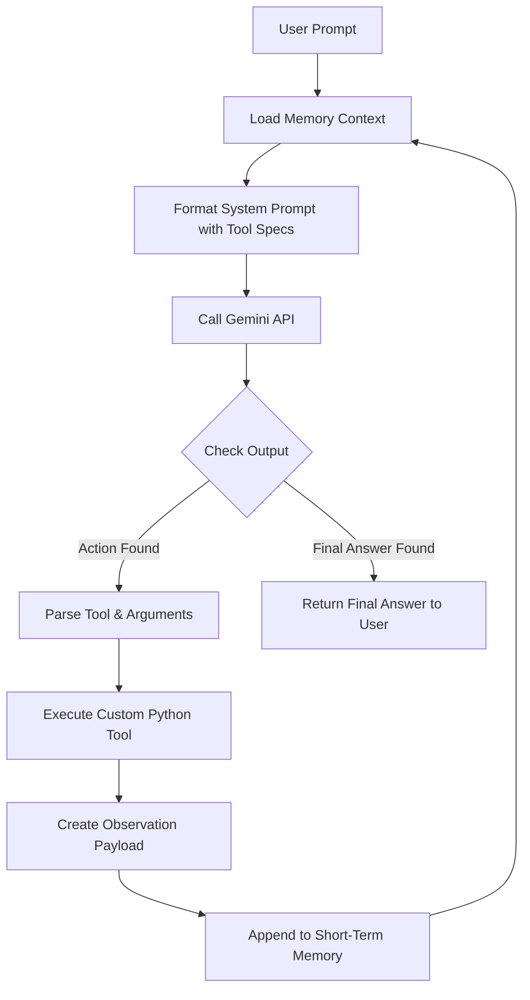

# 🏛️ Agent Architecture & Core Mechanics

This document provides a technical dive into the architecture and execution pipeline of the Modern AI Agent.

---

## 1. High-Level Flow

The agent runs inside a **ReAct (Reason + Act)** loop. This strategy combines reasoning (thought-mapping) and acting (tool-execution) dynamically to solve complex, open-ended tasks.



---

## 2. Core Components

### A. Configuration Manager (`agent/config.py`)
Loads settings from the `.env` file and operating system shell context. Ensures important API keys, model parameters, and log parameters are loaded safely with smart fallbacks.

### B. LLM Wrapper (`agent/llm.py`)
Encapsulates communication with Google Gemini via the `google-genai` SDK. Translates conversation histories and system instructions into standard payloads. It operates inside a clean abstract layer, making it easy to swap LLM providers if required.

### C. Tools Decorator & Registry (`agent/tools/base.py`)
Automates the schema creation process. By inspecting standard Python signatures:
* **Function Names** become the tool call IDs.
* **Docstrings** are parsed to extract description guidelines for the LLM.
* **Type Annotations** are mapped to JSON schema parameters.

This lets developers write plain Python code, while the registry generates the exact API schemas the agent needs to supply the model.

### D. Memory Buffer (`agent/memory/short_term.py`)
Retains an ordered log of standard user queries, model thought processes, tool actions, and raw observations. This acts as the "working memory" of the model within a chat session.

### E. Orchestrator Loop (`agent/core.py`)
The engine of the Agent.
1. Formulates the prompt with updated system instructions, tool definitions, and memory buffers.
2. Invokes the LLM to get the next step.
3. Checks if the output matches the standard ReAct protocol:
   * **Thought**: The reasoning string.
   * **Action**: Name of the tool to execute.
   * **Arguments**: JSON values for the tool parameters.
4. If a tool call is matched:
   * Safely invokes the Python function using standard keyword arguments.
   * Feeds the result back as an **Observation**.
   * Recurs through the loop until it detects the **Final Answer** keyword or hits an execution safety limit (typically 5 to 10 iterations to prevent infinite loops).

---

## 3. Formatting Protocol

To maintain maximum safety and compatibility across general open-source models, the default mode utilizes string parsing with robust regex triggers. The prompt requires the model to output a strict grammar structure:

```text
Thought: I need to write the user's poem to a file, then read it. First, I will call the write_file tool.
Action: write_file
Arguments: {
  "filename": "poem.txt",
  "content": "Coding is fun,\nBugs are run."
}
```

Once executed, the orchestrator appends:

```text
Observation: File write successful. 26 bytes written to poem.txt.
```

This sequence continues until the model outputs:

```text
Thought: I have successfully created the file and verified it. I can now provide the final response to the user.
Final Answer: I have saved your poem in poem.txt. It contains 2 lines of text.
```

All **7 test cases passed successfully** under the active `gpt-4o` configuration!

### Live SSE Generator Fix:
* **Issue**: In Python 3.7+, raising `StopIteration` inside a thread executor that returns a Future (e.g. `asyncio.to_thread`) caused a `TypeError` due to future exceptions checking.
* **Resolution**: Replaced direct generator invocation inside the thread with a safe wrapper `advance_generator(gen)` that captures `StopIteration` and returns `None` as a sentinel value, allowing the FastAPI stream to terminate gracefully and reliably.
